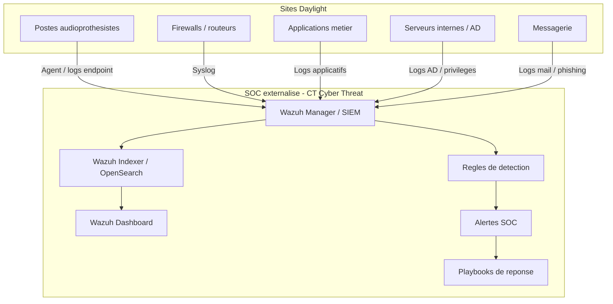

# Rapport technique groupe - version consolidee

## Mise en place d'un SOC externalise pour un reseau d'audioprothesistes

Equipe projet :

| Membre | Role principal |
|---|---|
| Yvan FOCSA | Architecture securite, infrastructure, flux reseau et industrialisation |
| Youssef GUERNIOU | Ingenierie SIEM, Wazuh, collecte et integration technique |
| Kilyan FELIX | Pilotage projet, cadrage, couts, suivi des livrables |
| Mahamadou DIACOUMBA | Detection SOC, regles, playbooks et incidents simules |

Client de demonstration : Daylight, reseau fictif de centres d'audioprothesistes.

Prestataire de demonstration : CT - Cyber Threat, SOC externalise fictif.

Version : consolidee pour rendu final.

## 1. Resume executif

Le projet consiste a concevoir et demontrer un SOC externalise pour un reseau d'audioprothesistes compose d'environ 30 points de vente en France. Le client souhaite centraliser les evenements de securite issus de ses postes de travail, serveurs, firewalls, applications metier et messagerie professionnelle afin de mieux detecter les attaques, qualifier les incidents et disposer d'une base industrialisable pour un futur modele d'infogerance.

La solution proposee repose sur un SIEM open-source centralise, Wazuh, deploye dans un environnement de demonstration. Le MVP couvre une chaine SOC complete : collecte de logs multi-source, regles de detection personnalisees, alertes exploitables, playbooks de reponse incident, preuves techniques et documentation.

Le premier sprint technique a permis de cadrer une plateforme Wazuh en mode single-node Docker, de rejouer des logs realistes Daylight et de documenter sept alertes correspondant aux principaux risques du cahier des charges : execution suspecte, brute force, acces anormal aux dossiers patients, modification d'un groupe privilegie, usage USB, phishing et scan reseau.

Le demonstrateur ne couvre pas encore un deploiement reel sur les 30 sites. Cette limite est volontaire : le MVP valide d'abord la faisabilite technique et methodologique avant industrialisation.

## 2. Contexte client

Daylight est un reseau d'audioprothesistes repartis sur plusieurs centres. Les utilisateurs manipulent des donnees sensibles, notamment des informations clients et des dossiers patients. Le systeme d'information est compose de postes de travail, d'equipements reseau, d'applications de rendez-vous et de suivi client, de serveurs internes et d'une messagerie professionnelle.

Le client fait face a plusieurs contraintes :

| Contrainte | Impact |
|---|---|
| Multiplicite des sites | Les evenements de securite sont disperses et difficiles a correler. |
| Donnees sensibles | Un acces non autorise peut avoir un impact important sur la confidentialite. |
| Ressources internes limitees | Le client ne peut pas exploiter seul un SOC complet. |
| Menaces croissantes | Phishing, brute force, malware, abus de droits et exfiltration sont des risques credibles. |
| Besoin de lisibilite | La direction doit disposer d'un reporting clair et actionnable. |

## 3. Objectifs du projet

Les objectifs fixes par le cahier des charges sont les suivants :

- deployer un SOC externalise centralisant les evenements de securite ;
- creer un environnement de demonstration operationnel ;
- fournir un systeme industrialisable, integrable dans un modele d'infogerance ;
- couvrir les postes de travail, routeurs/firewalls, applications metiers, serveurs internes et messagerie ;
- produire des dashboards lisibles ;
- creer des regles de detection et des alertes personnalisables ;
- documenter des playbooks de reponse semi-automatises ;
- fournir un rapport technique complet, un guide de deploiement et une video de demonstration.

## 4. Problematique

La problematique retenue est la suivante :

Comment concevoir un SOC externalise open-source, securise, lisible et industrialisable, capable de superviser plusieurs sites d'audioprothesistes et de detecter les evenements de securite critiques sur les principales briques du systeme d'information ?

Cette problematique implique de traiter a la fois des enjeux techniques, organisationnels et documentaires. La solution ne doit pas seulement fonctionner en laboratoire : elle doit aussi etre explicable, reproductible et credible pour une extension future a plusieurs dizaines de sites.

## 5. Perimetre du MVP

Le cahier des charges cible environ 30 points de vente. Pour le MVP, le choix retenu est de simuler un environnement representatif plutot que de tenter de reproduire directement les 30 sites.

| Element | Perimetre MVP |
|---|---|
| Nombre de sites | Sites simules representatifs du reseau client |
| SIEM | Wazuh Manager, Indexer et Dashboard |
| Collecte | Logs rejoues et sources multi-familles |
| Detection | Regles Wazuh personnalisees |
| Reponse | Playbooks documentes |
| Preuves | Logs, alertes, etats services, tableaux de synthese |

Les preuves techniques du sprint 01 sont stockees dans `livrables/preuves/sprint-01`.

## 6. Briques SI couvertes

| Brique SI du cahier des charges | Besoin de monitoring | Couverture MVP |
|---|---|---|
| Postes de travail | Authentifications locales, executions suspectes, usage USB | Logs endpoint Daylight et regles Wazuh. |
| Routeurs / firewalls | Flux reseau, acces non autorises, configuration | Logs firewall/syslog Daylight. |
| Applications metier | Logs applicatifs, erreurs, acces anormaux | Logs applicatifs Daylight CRM. |
| Serveurs internes / AD | Acces partages, elevation de privileges | Logs AD simules et regle groupe privilegie. |
| Messagerie professionnelle | Phishing, pieces jointes, liens suspects | Scenario phishing prevu en extension ; execution PowerShell sert de suite possible post-phishing. |

## 7. Architecture cible

La solution est construite autour d'un SOC centralise exploite par un prestataire. Les sites clients transmettent leurs logs vers la plateforme SOC. Les analystes utilisent l'interface web pour consulter les alertes, investiguer et appliquer les playbooks.

Schema source : `etape 1/diagrams/architecture_soc_externalise.mmd`.

## 8. Choix techniques

| Composant | Choix | Justification |
|---|---|---|
| SIEM | Wazuh | Open-source, centralise, adapte a un MVP SOC, compatible agents et regles personnalisees. |
| Indexation | Wazuh Indexer / OpenSearch | Necessaire pour stocker et interroger les evenements. |
| Interface | Wazuh Dashboard | Interface web repondant au cahier des charges. |
| Detection | Regles Wazuh locales | Adaptables aux scenarios metier du client. |
| Logs de demonstration | Logs Daylight simules | Permettent une demo stable et reproductible. |
| Playbooks | Markdown | Lisibles, versionnables et integrables au rapport. |
| Deploiement MVP | Docker single-node | Rapide a mettre en place pour un demonstrateur. |

## 9. Implementation MVP

La plateforme Wazuh est deployee en mode single-node Docker. Les services principaux sont :

- Wazuh Manager ;
- Wazuh Indexer ;
- Wazuh Dashboard.

Le choix de Docker est assume pour le demonstrateur. L'objectif du MVP est de valider la chaine SOC complete de maniere reproductible : generation de logs, ingestion, detection, alerting, dashboard et reponse incident. Les conteneurs permettent de simuler rapidement plusieurs briques du systeme d'information client sans devoir maintenir autant de machines virtuelles lourdes.

Dans ce contexte, Docker est utilise pour representer les serveurs, services applicatifs, generateurs de logs et composants SOC. Pour une mise en production, certains elements seraient remplaces ou completes par des actifs reels : postes Windows avec agent Wazuh, serveurs internes, Active Directory, firewall physique ou virtuel et applications metier de production.

Le perimetre SIEM documente par Youssef ajoute un script d'automatisation `scripts/setup-siem-lab.ps1`. Il cree le serveur Linux simule `serveur-01`, installe un agent Wazuh 4.14.5-1, active SSH/rsyslog, collecte `/var/log/auth.log`, simule une brute force SSH attendue en alerte `5712` et configure le RBAC de demonstration avec les comptes `analyste` et `supervision` en lecture seule.

Cette approche est donc adaptee au MVP car elle rend l'environnement leger, portable et facilement rejouable. Elle reste compatible avec l'industrialisation, car les flux et procedures definis dans Docker peuvent ensuite etre transposes vers des VMs ou equipements reels.

Preuve de suivi disponible : `livrables/preuves/sprint-01/docker-compose-ps.txt`.

Etat attendu pour la plateforme de demonstration :

| Service | Image | Statut observe |
|---|---|---|
| Wazuh Dashboard | `wazuh/wazuh-dashboard:4.14.5` | Conteneur actif |
| Wazuh Indexer | `wazuh/wazuh-indexer:4.14.5` | Conteneur actif |
| Wazuh Manager | `wazuh/wazuh-manager:4.14.5` | Conteneur actif |

Les services internes Wazuh essentiels sont egalement presents : `wazuh-logcollector`, `wazuh-remoted`, `wazuh-analysisd`, `wazuh-execd`, `wazuh-db`, `wazuh-authd` et `wazuh-apid`.

Preuve de suivi disponible : `livrables/preuves/sprint-01/wazuh-manager-status.txt`.

## 10. Sources de logs integrees

| Source | Fichier de demonstration | Risque couvert |
|---|---|---|
| Endpoint | `etape 1/logs/generated/endpoint_events.jsonl` | Execution suspecte, usage USB |
| Firewall / syslog | `etape 1/logs/generated/firewall_syslog.log` | Brute force, acces distant non autorise, scan reseau |
| Application metier | `etape 1/logs/generated/application_events.jsonl` | Acces anormal aux dossiers patients |
| Active Directory | `etape 1/logs/generated/ad_events.jsonl` | Modification groupe privilegie |
| Messagerie | `etape 1/logs/generated/mail_events.jsonl` | Suspicion phishing |

Ces fichiers permettent de rejouer des evenements realistes dans le SIEM, de valider les regles et de produire des preuves stables pour le rapport et la video.

## 11. Regles de detection

Les regles personnalisees sont stockees dans `etape 1/detection/wazuh/local_rules.xml`.

| ID | Niveau | Scenario | MITRE ATT&CK |
|---|---:|---|---|
| 100100 | 10 | Execution PowerShell suspecte sur poste audioprothesiste | T1059.001 |
| 100110 | 12 | Brute force suspecte sur acces distant | T1110 |
| 100120 | 10 | Acces anormal aux dossiers patients | T1530 |
| 100130 | 14 | Modification d'un groupe privilegie | T1098 |
| 100140 | 7 | Usage USB detecte sur poste supervise | T1091 |
| 100150 | 10 | Suspicion phishing messagerie | T1566 |
| 100160 | 8 | Suspicion scan reseau | T1046 |

Ces regles repondent aux attentes du cahier des charges car elles ciblent des comportements concrets sur les endpoints, l'acces distant, les applications metier et les privileges.

## 12. Alertes obtenues

Le sprint 01 a permis de documenter sept alertes Daylight, dont cinq alertes majeures directement exploitees dans la video.

Preuve disponible : `livrables/preuves/sprint-01/daylight-alerts-table.md`.

| ID | Niveau | Description | Source |
|---|---:|---|---|
| 100100 | 10 | Execution PowerShell suspecte sur poste audioprothesiste | Endpoint |
| 100110 | 12 | Brute force suspecte detectee sur acces distant | Firewall/syslog |
| 100120 | 10 | Acces anormal aux dossiers patients | Application metier |
| 100130 | 14 | Modification d'un groupe privilegie | AD / privileges |
| 100140 | 7 | Usage USB detecte sur poste supervise | Endpoint |
| 100150 | 10 | Suspicion phishing messagerie | Messagerie |
| 100160 | 8 | Suspicion scan reseau | Firewall/syslog |

Le resultat valide la chaine minimale : evenement source, ingestion, analyse, regle, alerte, preuve documentaire.

## 13. Dashboards attendus

Les dashboards doivent permettre une lecture par role.

| Dashboard | Public | Contenu attendu |
|---|---|---|
| Supervision globale | Client / superviseur | Alertes par criticite, par site, par type et timeline. |
| Analyste SOC | Analyste | Alertes recentes, details source, utilisateur, IP, machine et evenement lie. |
| Administration technique | Admin SOC | Etat des agents, volume de logs, erreurs de collecte, sources silencieuses. |

Captures disponibles dans `livrables/preuves/sprint-01/captures-dashboard/` :

- supervision globale ;
- vue alertes recentes ;
- detail d'une alerte `100100` ;
- detail d'une alerte `100110` ;
- tableau de bord par criticite ;
- details des alertes `100120`, `100130`, `100140`, `100150` et `100160`.

## 14. Playbooks de reponse incident

Les playbooks documentent la reponse attendue pour les incidents principaux.

| Scenario | Playbook |
|---|---|
| Brute force | `etape 1/playbooks/PB-001-Brute-Force.md` |
| Execution suspecte | `etape 1/playbooks/PB-002-Execution-Suspecte.md` |
| Acces dossier patient | `etape 1/playbooks/PB-004-Acces-Dossier-Patient.md` |
| Phishing | `etape 1/playbooks/PB-005-Phishing.md` |
| Scan reseau | `etape 1/playbooks/PB-006-Scan-Reseau.md` |
| USB suspect | `etape 1/playbooks/PB-003-USB-Suspect.md` |

Chaque playbook suit la meme logique : qualification, verification du contexte, confinement si necessaire, remediation, documentation, amelioration.

## 15. REX des incidents simules

Un premier REX est disponible dans `livrables/rapport-final/rex-incidents-simules.md`.

Les incidents documentes sont :

| Incident | Risque | Reponse SOC |
|---|---|---|
| Execution PowerShell suspecte | Payload post-phishing ou malware | Qualification, analyse reseau, isolement poste si confirme. |
| Brute force acces distant | Compromission compte ou acces RDP | Blocage IP, verification succes connexion, recommandation MFA/VPN. |
| Acces anormal dossiers patients | Atteinte confidentialite | Verification metier, suspension compte si non justifie, rapport client. |
| Modification groupe privilegie | Elevation privileges / persistance | Verification changement, retrait compte, audit admin. |
| Usage USB | Exfiltration ou introduction malware | Verification politique USB, identification support, controle poste. |

## 16. Gestion des couts

### 16.1 Couts du MVP

| Poste | Hypothese | Cout direct |
|---|---|---|
| SIEM | Wazuh open-source | 0 EUR licence |
| Deploiement | Docker single-node | 0 EUR hors machine |
| Logs de demonstration | Generes en interne | 0 EUR |
| Documentation | Markdown / PDF | 0 EUR |
| Travail equipe | Projet pedagogique | Non facture |

### 16.2 Couts de production a anticiper

| Poste | Description |
|---|---|
| Infrastructure | Serveur dedie, cloud ou environnement prestataire. |
| Stockage | Retention des logs, indexation, sauvegardes. |
| Exploitation SOC | Temps analyste, astreinte, supervision, reporting. |
| Deploiement sites | Installation agents, configuration syslog, validation collecte. |
| Maintenance | Mises a jour, durcissement, controle sante SIEM. |

La strategie de maitrise des couts repose sur la standardisation : agents preconfigures, templates syslog, conventions de nommage, dashboards reutilisables et checklist d'onboarding.

## 17. Organisation projet

Le projet est organise autour de quatre roles complementaires.

| Membre | Contribution attendue |
|---|---|
| Kilyan FELIX | Cadrage, planning, couts, relation client, coherence globale. |
| Yvan FOCSA | Architecture reseau, flux, industrialisation, securisation du modele multi-sites. |
| Youssef GUERNIOU | Installation Wazuh, collecte, agents, dashboard, guide technique. |
| Mahamadou DIACOUMBA | Scenarios d'attaque, detection, playbooks, REX SOC. |

Methode retenue : agile hybride, avec backlog, preuves techniques par sprint et documentation continue.

## 18. Industrialisation vers 30 sites

Le passage du MVP a une solution industrialisable necessite :

- une convention de nommage des sites et machines ;
- un template d'onboarding site ;
- un package d'installation agent ;
- une configuration syslog standard pour firewalls ;
- une politique de retention des logs ;
- des dashboards filtrables par site ;
- un reporting mensuel ;
- une supervision de la sante des agents ;
- un processus de mise a jour des regles.

Un nouveau site doit etre integre selon la sequence suivante :

1. Recenser les equipements et applications.
2. Declarer le site dans l'inventaire.
3. Installer les agents endpoints et serveurs.
4. Configurer le forwarding syslog.
5. Integrer les logs applicatifs.
6. Generer une alerte de test.
7. Valider l'apparition dans le dashboard.
8. Ajouter les captures au dossier client.

## 19. Limites actuelles

| Limite | Impact | Suite prevue |
|---|---|---|
| Logs rejoues et non production | Le MVP prouve la chaine SOC mais pas encore un deploiement reel complet | Installer des agents sur VMs. |
| Captures Wazuh live | Elles prouvent la lecture SOC dans la vraie interface Wazuh apres injection des logs Daylight | `livrables/preuves/wazuh-live-captures/`. |
| Messagerie encore simulee | Le phishing est couvert par logs dedies mais pas par integration mail reelle | Ajouter une integration mail en production. |
| Pas de haute disponibilite | Suffisant pour MVP, insuffisant production | Proposer architecture HA. |
| Pas encore de SOAR | Reponse semi-automatisee limitee | Evaluer Shuffle ou TheHive. |

## 20. Perspectives d'evolution

Les evolutions proposees sont :

- ajout d'une sonde Suricata pour detection reseau ;
- integration de TheHive pour la gestion de tickets incidents ;
- ajout de Shuffle pour automatiser certaines reponses ;
- integration MISP pour enrichissement threat intelligence ;
- mise en place de RBAC avance par role ;
- haute disponibilite du SIEM ;
- reporting client mensuel automatise ;
- deploiement agent industrialise sur les 30 sites.

## 21. Conclusion

Le projet valide un socle SOC externalise coherent avec le cahier des charges. La solution repose sur Wazuh, couvre plusieurs sources de logs, documente sept alertes representatives et fournit des playbooks de reponse incident.

Le MVP montre la valeur d'un SOC externalise pour Daylight : centralisation, detection, qualification, reporting et industrialisation possible. Les preuves visuelles et documentaires sont centralisees dans `livrables/preuves/sprint-01`.

## 22. Annexes a joindre

| Annexe | Emplacement |
|---|---|
| Architecture SOC | `etape 1/diagrams/architecture_soc_externalise.mmd` |
| Flux collecte | `etape 1/diagrams/flux_collecte_logs.mmd` |
| Regles Wazuh | `etape 1/detection/wazuh/local_rules.xml` |
| Alertes detectees | `livrables/preuves/sprint-01/daylight-alerts-table.md` |
| Etat Wazuh | `livrables/preuves/sprint-01/wazuh-manager-status.txt` |
| REX incidents | `livrables/rapport-final/rex-incidents-simules.md` |
| Playbooks | `etape 1/playbooks/` |
| Script SIEM Youssef | `scripts/setup-siem-lab.ps1` |
| Documentation SIEM Youssef | `livrables/youssef/supports/Documentation_SIEM_Youssef_GUERNIOU.pdf` |
| Script video | `livrables/mvp-video/script-video.md` |
