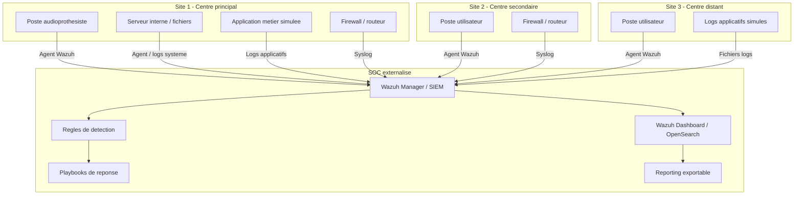

# Partie Yvan FOCSA - Cadrage, architecture et organisation du projet

## 1. Role dans le projet

Dans le cadre du projet de mise en place d'un SOC externalise pour un reseau d'audioprothesistes, mon role est celui de coordinateur projet et architecte securite. Ma responsabilite principale est de garantir la coherence globale du projet, depuis l'analyse du besoin jusqu'a la structuration de l'architecture technique, l'organisation de l'equipe, la planification, la gestion des couts et la preparation des livrables.

Mon objectif est de m'assurer que la solution proposee reste alignee avec le cahier des charges, qu'elle soit realiste dans le cadre d'un demonstrateur, reproductible pour plusieurs sites clients et suffisamment documentee pour etre industrialisable dans un modele d'infogerance SOC.

## 2. Contexte client

Le client est un reseau de centres d'audioprothesistes repartis sur une trentaine de points de vente en France. Chaque centre utilise des postes de travail metier, des equipements reseau, des applications de gestion des rendez-vous et dossiers patients, des serveurs internes et une messagerie professionnelle.

La direction souhaite renforcer sa capacite de detection et de reaction face aux menaces cyber, mais ne dispose pas de ressources internes suffisantes pour exploiter un SOC complet en interne. Le projet consiste donc a concevoir une plateforme SOC externalisee capable de centraliser les evenements de securite, de produire des alertes exploitables et de fournir une base industrialisable pour un futur service d'infogerance.

## 3. Problematique

La problematique principale est la suivante :

Comment concevoir un SOC externalise, open-source, securise, lisible et industrialisable, capable de superviser plusieurs sites d'audioprothesistes et de detecter les evenements de securite critiques sur les principales briques du systeme d'information ?

Cette problematique implique plusieurs enjeux :

| Enjeu | Description |
|---|---|
| Centralisation | Regrouper les logs de plusieurs sites dans une plateforme unique. |
| Detection | Identifier les comportements suspects sur postes, serveurs, reseau, applications et messagerie. |
| Lisibilite | Fournir des dashboards comprehensibles par les profils supervision, analyste et admin. |
| Reproductibilite | Proposer une architecture deployable sur plusieurs centres clients. |
| Industrialisation | Preparer des templates, procedures et guides pour faciliter un deploiement a grande echelle. |
| Securite | Proteger la collecte, l'acces aux interfaces et les donnees journalisees. |

## 4. Objectifs du projet

Les objectifs du projet sont les suivants :

| Objectif | Reponse proposee |
|---|---|
| Deployer un SOC externalise | Mise en place d'un SIEM centralise base sur Wazuh. |
| Centraliser les evenements de securite | Collecte multi-source via agents, syslog et logs applicatifs simules. |
| Creer un environnement de demonstration | Simulation de plusieurs sites clients avec postes, serveur, firewall et application metier. |
| Produire des alertes personnalisables | Creation de regles de detection adaptees aux menaces du contexte client. |
| Fournir des dashboards lisibles | Tableaux de bord segmentes par usage : supervision, analyste SOC, administration. |
| Mettre en place des playbooks | Procedures de reponse semi-automatisees pour les incidents simules. |
| Rendre la solution industrialisable | Documentation, templates de deploiement et guide d'exploitation. |

## 5. Perimetre du demonstrateur

Le cahier des charges mentionne un reseau d'une trentaine de points de vente. Pour le MVP, nous proposons de simuler trois sites representatifs afin de prouver le fonctionnement de la solution sans complexifier inutilement l'environnement.

### 5.1 Sites simules

| Site | Role dans la demonstration | Elements simules |
|---|---|---|
| Site 1 - Centre principal | Site le plus complet | Poste utilisateur, serveur interne, firewall, application metier. |
| Site 2 - Centre secondaire | Site distant standard | Poste utilisateur, firewall, logs reseau. |
| Site 3 - Centre distant | Site leger | Poste utilisateur, logs applicatifs et securite. |

Cette approche permet de demontrer la scalabilite de la solution : le modele est teste sur 3 sites mais pense pour etre etendu a 30 centres.

### 5.2 Briques SI couvertes

| Brique SI | Besoins du cahier des charges | Couverture dans le MVP |
|---|---|---|
| Postes de travail | Authentifications locales, executions suspectes, usage USB | Agent Wazuh, logs Windows/Linux, Sysmon si disponible. |
| Routeurs / firewall | Flux reseau, acces non autorises, configuration | Syslog firewall/pfSense ou generation de logs reseau realistes. |
| Applications metiers | Logs applicatifs, erreurs, acces anormaux | Application metier simulee CRM/RDV/dossiers patients. |
| Serveurs internes | Active Directory, fichiers, elevation de privileges | Serveur Windows/Linux simule, logs d'acces fichiers et comptes. |
| Messagerie professionnelle | Phishing, spam, pieces jointes suspectes | Logs de phishing simules et scenario d'alerte dedie. |

### 5.3 Hors perimetre du MVP

Les elements suivants ne sont pas prevus dans le demonstrateur initial, mais peuvent etre presentes comme perspectives d'evolution :

| Element | Justification |
|---|---|
| Supervision reelle de 30 sites | Non necessaire pour un MVP, mais le modele est extensible. |
| Traitement de donnees patients reelles | Interdit pour des raisons de confidentialite et de conformite. |
| SOC 24/7 complet | Le projet demontre les briques techniques et methodologiques, pas une exploitation continue reelle. |
| Automatisation complete de la reponse | Le cahier des charges demande des playbooks semi-automatises, ce qui est plus realiste. |

## 6. Architecture technique cible

L'architecture cible repose sur un SOC centralise recevant les evenements de securite depuis plusieurs sites clients simules. Chaque site envoie ses logs vers le SIEM central via agents, syslog ou scripts de generation de logs. Les analystes SOC consultent les alertes, dashboards et rapports depuis une interface web.

## 7. Choix techniques recommandes

| Composant | Choix recommande | Justification |
|---|---|---|
| SIEM | Wazuh | Open-source, adapte a un SOC demonstrateur, interface web, agents, regles et alertes. |
| Moteur de recherche | OpenSearch integre a Wazuh | Necessaire pour indexer et consulter les evenements. |
| Collecte postes | Agents Wazuh | Collecte centralisee des evenements systeme et securite. |
| Logs Windows avances | Sysmon optionnel | Permet de detecter executions suspectes, processus et activite locale. |
| Logs firewall | Syslog ou pfSense | Repond au besoin de supervision routeur/firewall. |
| Detection reseau | Suricata optionnel | Ajoute une brique IDS si l'equipe a le temps. |
| Automatisation | Scripts Bash/Python ou Shuffle optionnel | Permet de creer des playbooks semi-automatises. |
| Documentation | Markdown/PDF | Simple a maintenir, exportable et lisible. |

Le choix de Wazuh est coherent avec le besoin du client car il permet de construire un SOC open-source centralise, de connecter plusieurs sources de logs, d'ecrire des regles de detection et de produire des dashboards accessibles via navigateur.

## 8. Surfaces d'attaque identifiees

| Surface d'attaque | Risques associes | Moyens de detection prevus |
|---|---|---|
| Postes utilisateurs | Malware, execution suspecte, usage USB non autorise | Agent Wazuh, Sysmon, regles sur evenements locaux. |
| Comptes utilisateurs | Brute force, authentification anormale, elevation de privileges | Logs d'authentification, correlation des echecs et succes. |
| Serveurs internes | Acces non autorise aux fichiers, modification de droits | Surveillance fichiers, logs systeme, alertes privilege escalation. |
| Firewall / routeur | Scan, connexion non autorisee, modification de configuration | Logs syslog, regles sur IP suspectes et ports sensibles. |
| Application metier | Acces anormal aux dossiers patients, erreurs repetees | Logs applicatifs simules, regles sur comportement inhabituel. |
| Messagerie | Phishing, piece jointe suspecte, lien malveillant | Logs de messagerie simules, playbook phishing. |

## 9. Scenarios de demonstration

Pour prouver la pertinence de la solution, nous retiendrons cinq scenarios de demonstration :

| Scenario | Objectif | Preuve attendue dans le SOC |
|---|---|---|
| Tentative de brute force | Demontrer la detection d'authentifications echouees repetees | Alerte SIEM, detail des logs, IP/source, compte cible. |
| Execution suspecte sur poste | Identifier un processus ou script inhabituel | Alerte endpoint, nom du processus, horodatage, poste concerne. |
| Usage USB suspect | Surveiller les usages locaux non conformes | Evenement poste, utilisateur, peripherique detecte. |
| Acces anormal dossier patient | Simuler un acces abusif a des donnees sensibles | Logs applicatifs/fichiers, utilisateur, ressource cible. |
| Phishing simule | Montrer une procedure de reaction SOC | Alerte phishing, qualification, playbook associe. |

Chaque scenario doit produire une trace visible dans le SIEM, une alerte exploitable, un tableau de bord ou une vue de consultation, puis une procedure de reponse documentee.

## 10. Organisation de l'equipe

| Membre | Role principal | Responsabilites |
|---|---|---|
| Yvan FOCSA | Coordinateur projet / Architecte securite | Cadrage, architecture, planning, backlog, gestion des couts, coherence des livrables, preparation de la demo. |
| Youssef GUERNIOU | Ingenieur SIEM | Installation Wazuh, collecte des logs, integration agents/syslog, documentation technique d'installation. |
| Kilyan FELIX | Analyste SOC | Cas d'usage, regles de detection, dashboards, analyse des alertes, qualification incidents. |
| Mahamadou DIACOUMBA | Blue Team / Reponse incident | Playbooks, procedures, generation d'evenements, scripts de remediation, guide d'exploitation. |

Le travail reste collectif pour la gestion de projet, la documentation, les tests, la soutenance et la video de demonstration.

## 11. Methodologie projet

Nous adoptons une methodologie agile hybride. L'objectif est de conserver une organisation claire, tout en gardant la flexibilite necessaire pour adapter le perimetre technique selon les resultats du demonstrateur.

### 11.1 Rituels

| Rituel | Frequence | Objectif |
|---|---|---|
| Point d'equipe | 1 fois par semaine | Suivre l'avancement, identifier les blocages, ajuster les priorites. |
| Revue technique | Toutes les deux semaines | Verifier les integrations, les logs collectes et les alertes. |
| Revue documentation | Toutes les deux semaines | S'assurer que les procedures et preuves sont mises a jour. |
| Repetition demo | Fin de projet | Securiser le deroule de la video et de la soutenance. |

### 11.2 Definition of Done

Une tache est consideree terminee si :

| Critere | Attendu |
|---|---|
| Fonctionnement | La fonctionnalite est testee dans l'environnement de demonstration. |
| Preuve | Une capture, un log ou une alerte permet de prouver le resultat. |
| Documentation | La procedure ou le choix technique est documente. |
| Reproductibilite | Un autre membre peut refaire l'action a partir du guide. |
| Alignement | La tache repond a un besoin du cahier des charges. |

## 12. Planning previsionnel

| Phase | Periode indicative | Objectifs | Responsable principal |
|---|---|---|---|
| Phase 1 - Cadrage | Semaine 1 | Perimetre, architecture, roles, backlog, choix techniques | Yvan |
| Phase 2 - Socle technique | Semaines 2 a 3 | Installation Wazuh, acces dashboard, premier agent connecte | Youssef |
| Phase 3 - Collecte multi-source | Semaines 4 a 5 | Agents postes, logs firewall, logs applicatifs, serveur interne | Youssef / Mahamadou |
| Phase 4 - Detection | Semaines 6 a 7 | Regles, alertes, cas d'usage, tableaux de bord | Kilyan |
| Phase 5 - Reponse incident | Semaines 8 a 9 | Playbooks, procedures, scripts, tests d'incidents simules | Mahamadou |
| Phase 6 - Consolidation | Semaines 10 a 11 | Documentation, couts, architecture finale, REX | Yvan / equipe |
| Phase 7 - Demo finale | Semaine 12 | Video, repetition, preuves, finalisation rapport | Toute l'equipe |

## 13. Backlog initial

| ID | Tache | Priorite | Responsable | Livrable associe |
|---|---|---|---|---|
| B1 | Rediger le cadrage projet | Haute | Yvan | Analyse initiale |
| B2 | Valider le perimetre MVP 3 sites | Haute | Yvan | Document de cadrage |
| B3 | Produire le schema d'architecture | Haute | Yvan | DAT |
| B4 | Installer le serveur Wazuh | Haute | Youssef | Demonstrateur |
| B5 | Connecter un premier agent | Haute | Youssef | Preuve de collecte |
| B6 | Collecter des logs firewall/syslog | Haute | Youssef | Integration reseau |
| B7 | Generer des logs applicatifs metier | Moyenne | Mahamadou | Logs CRM/RDV simules |
| B8 | Creer une regle brute force | Haute | Kilyan | Alerte SOC |
| B9 | Creer une regle execution suspecte | Haute | Kilyan | Alerte endpoint |
| B10 | Creer un dashboard supervision | Haute | Kilyan | Dashboard |
| B11 | Rediger le playbook brute force | Haute | Mahamadou | Procedure SOC |
| B12 | Rediger le playbook phishing | Moyenne | Mahamadou | Procedure SOC |
| B13 | Documenter le guide de deploiement | Haute | Youssef / Yvan | Guide technique |
| B14 | Documenter le guide d'utilisation | Haute | Kilyan / Mahamadou | Guide utilisateur |
| B15 | Realiser le REX incidents simules | Haute | Yvan / equipe | Rapport final |
| B16 | Preparer le script de video | Haute | Yvan / equipe | Video MVP |
| B17 | Finaliser les couts et l'industrialisation | Moyenne | Yvan | Rapport final |

## 14. Gestion des couts

Le projet privilegie des solutions open-source afin de reduire les couts logiciels et de proposer une solution accessible a un reseau de centres de taille moyenne.

### 14.1 Couts du demonstrateur

| Poste de cout | Hypothese MVP | Impact |
|---|---|---|
| Licences SIEM | Wazuh open-source | Cout logiciel nul pour le demonstrateur. |
| Infrastructure | VMs locales ou serveur de test | Cout limite au materiel deja disponible. |
| Stockage logs | Volume faible pour la demonstration | Dimensionnement reduit. |
| Temps projet | Repartition entre 4 membres | Cout principal : temps de conception, integration et documentation. |
| Outils complementaires | Suricata, Sysmon, scripts | Open-source ou gratuits. |

### 14.2 Couts a anticiper en production

| Poste | Risque de cout | Recommandation |
|---|---|---|
| Hebergement | Serveur dedie, cloud ou infrastructure prestataire | Dimensionner selon le volume de logs et la retention souhaitee. |
| Stockage | Conservation des logs sur plusieurs mois | Definir une politique de retention adaptee au besoin legal et metier. |
| Exploitation SOC | Temps analyste, astreinte, supervision | Prevoir un modele d'infogerance avec niveaux de service. |
| Maintenance | Mises a jour, sauvegardes, supervision du SIEM | Integrer une procedure mensuelle. |
| Onboarding sites | Installation agents, configuration syslog, validation collecte | Industrialiser via templates et checklist. |

### 14.3 Strategie d'optimisation

Pour maitriser les couts, la solution sera concue selon trois principes :

| Principe | Application |
|---|---|
| Open-source first | Utiliser Wazuh et des composants gratuits lorsque cela est pertinent. |
| Mutualisation | Un SOC central pour plusieurs sites clients. |
| Standardisation | Templates de configuration et guides pour reduire le temps de deploiement. |

## 15. Criteres d'acceptation

Le MVP sera considere conforme si les criteres suivants sont atteints :

| Critere | Validation attendue |
|---|---|
| Interface web accessible | Dashboard SOC consultable depuis un navigateur. |
| Collecte multi-source | Logs provenant d'au moins trois types de sources. |
| Detection personnalisee | Plusieurs regles specifiques au contexte client. |
| Alertes exploitables | Alertes comprenant source, criticite, horodatage et contexte. |
| Dashboards segmentes | Vues adaptees a la supervision et a l'analyse SOC. |
| Playbooks disponibles | Procedures de reponse pour les principaux incidents. |
| Reproductibilite | Guide permettant de redeployer la solution. |
| Scalabilite argumentee | Explication du passage de 3 sites simules a 30 sites reels. |
| Documentation complete | Rapport technique, guide de deploiement, guide d'utilisation, REX. |
| Demonstration video | Scenario clair : besoin, solution, demonstration, conclusion. |

## 16. Alignement avec le cahier des charges

| Exigence du cahier des charges | Reponse du projet |
|---|---|
| SOC externalise | Architecture centralisee hebergeant le SIEM cote prestataire. |
| SIEM open-source centralise | Wazuh comme socle principal. |
| Collecte multi-source | Agents, syslog, logs applicatifs et logs simules. |
| Dashboards lisibles | Tableaux de bord par usage et par source. |
| Regles de detection | Cas d'usage brute force, USB, execution suspecte, phishing, acces anormal. |
| Playbooks semi-automatises | Procedures documentees et scripts simples. |
| Reporting exportable | Exports et captures integres au rapport final. |
| Interface claire | Wazuh Dashboard accessible via navigateur. |
| Simulation de sites clients | Trois sites representatifs modelises. |
| Templates de deploiement | Guide et checklist d'onboarding site. |
| Video de demonstration | Demonstration MVP structuree besoin, solution, demo. |

## 17. Synthese de ma contribution

Ma contribution consiste a structurer le projet pour permettre a l'equipe d'avancer efficacement et de produire un demonstrateur coherent. J'assure le cadrage du besoin, la definition du perimetre, l'architecture cible, la repartition des roles, le planning, le backlog, la gestion des couts et le controle de l'alignement avec le cahier des charges.

Cette partie sert de base au document d'architecture technique, au rapport final et a la video de demonstration. Elle permet egalement de justifier les choix faits par l'equipe et de montrer que le projet est pense comme une solution professionnelle, reproductible et industrialisable.
