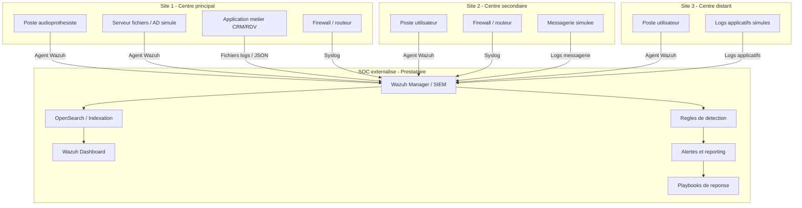

# 02 - Dossier d'architecture technique

## 1. Vue d'ensemble

La solution proposee repose sur un SOC externalise centralise. Les sites clients simules transmettent leurs evenements de securite vers une plateforme Wazuh, qui assure la collecte, l'indexation, la correlation, l'alerting et la visualisation.

Le modele est teste sur 3 sites MVP mais concu pour etre etendu aux 30 points de vente du client.

## 2. Schema d'architecture globale

Source Mermaid : [../diagrams/architecture_soc_externalise.mmd](../diagrams/architecture_soc_externalise.mmd)

## 3. Topologie MVP

Source Mermaid : [../diagrams/topologie_sites_mvp.mmd](../diagrams/topologie_sites_mvp.mmd)

| Zone | Composants | Role |
|---|---|---|
| SOC central | Wazuh Manager, OpenSearch, Dashboard | Collecte, correlation, visualisation et alerting. |
| Site 1 | Poste, serveur, application, firewall | Site le plus complet pour la demo. |
| Site 2 | Poste, firewall, messagerie | Site secondaire oriente reseau et phishing. |
| Site 3 | Poste, logs applicatifs | Site leger pour prouver la scalabilite. |

## 4. Composants techniques

| Composant | Description | Responsable |
|---|---|---|
| Wazuh Manager | Coeur SIEM, recoit les evenements et applique les regles | Youssef |
| Wazuh Dashboard | Interface web de supervision | Youssef / Kilyan |
| OpenSearch | Stockage et indexation des evenements | Youssef |
| Agents Wazuh | Collecte endpoint sur postes et serveurs | Youssef |
| Syslog | Collecte des firewalls et routeurs | Youssef |
| Logs applicatifs | Simulation CRM/RDV/dossiers patients | Mahamadou |
| Regles de detection | Detection des scenarios SOC | Kilyan |
| Playbooks | Procedures de qualification et reponse | Mahamadou |
| Documentation | Rapport, guide et preuves | Yvan / equipe |

## 5. Flux de collecte

Source Mermaid : [../diagrams/flux_collecte_logs.mmd](../diagrams/flux_collecte_logs.mmd)

| Source | Mode de collecte | Exemple d'evenement |
|---|---|---|
| Poste utilisateur | Agent Wazuh | Echec de connexion, processus suspect, USB branche. |
| Serveur interne | Agent Wazuh | Elevation de privilege, acces partage, creation compte. |
| Firewall | Syslog | Scan de ports, connexion refusee, trafic suspect. |
| Application metier | Fichier log JSON | Acces dossier patient, erreur authentification, volume anormal. |
| Messagerie | Log simule | Email suspect, piece jointe bloquee, lien phishing. |

## 6. Flux techniques a defendre

Les ports ci-dessous correspondent au cadrage MVP et aux flux classiques a documenter. En production, ils devraient etre limites par pare-feu, VPN, filtrage inter-zones et journalisation des acces d'administration.

| Flux | Source | Destination | Protocole / port indicatif | Securisation attendue |
|---|---|---|---|---|
| Collecte agent | Postes / serveurs | Wazuh Manager | TCP/UDP 1514 | Agent enregistre, flux limite au SOC. |
| Enrolement agent | Postes / serveurs | Wazuh Manager | TCP 1515 | Usage ponctuel, controle des agents autorises. |
| Syslog firewall | Firewall / routeur | Wazuh Manager | UDP/TCP 514 ou port dedie | Source autorisee, filtrage par IP, horodatage fiable. |
| Dashboard SOC | Analyste / admin | Wazuh Dashboard | HTTPS 443 | Acces restreint, comptes nominatifs, RBAC. |
| API Wazuh | Dashboard / admin | Wazuh Manager | TCP 55000 | Acces interne ou admin uniquement. |
| Indexation | Wazuh Manager | Wazuh Indexer | TCP 9200 | Flux interne SOC, non expose aux sites. |
| Logs applicatifs | Application metier | Agent ou collecteur Wazuh | Fichier local / volume / API | Donnees fictives en MVP, masquage en production. |

## 7. Modele de securisation

| Risque | Mesure prevue |
|---|---|
| Acces non autorise au dashboard | Comptes separes par role, mots de passe robustes, acces restreint. |
| Perte de logs | Retention definie, sauvegarde configuration, export preuves. |
| Donnees sensibles dans les logs | Donnees fictives dans le MVP, masquage en production. |
| Mauvaise configuration agents | Checklist d'onboarding site. |
| Faux positifs | Qualification SOC et amelioration continue des regles. |
| Indisponibilite SOC | Procedure de redemarrage et verification services. |

## 8. Roles d'acces

| Role | Droits attendus | Usage |
|---|---|---|
| Supervision | Lecture dashboards et alertes | Suivi global de l'etat securite. |
| Analyste SOC | Analyse alertes, commentaires, exports | Investigation et qualification. |
| Administrateur | Configuration agents, regles, integrations | Maintien de la plateforme. |
| Client / Direction | Reporting synthetique | Lecture des indicateurs et incidents majeurs. |

## 9. Extension vers 30 sites

Pour passer de 3 sites simules a 30 sites reels, le projet doit prevoir :

- un modele standard d'installation agent ;
- une convention de nommage des sites, machines et logs ;
- une checklist d'onboarding site ;
- des templates de configuration syslog ;
- une politique de retention des logs ;
- des dashboards filtrables par site ;
- une procedure de validation de collecte ;
- un reporting mensuel par site et global.

## 10. Convention de nommage

| Objet | Convention | Exemple |
|---|---|---|
| Site | `SITE-XX-NOM` | `SITE-01-PARIS` |
| Poste | `PC-SXX-ROLE-NN` | `PC-S01-AUDIO-01` |
| Serveur | `SRV-SXX-FONCTION` | `SRV-S01-FICHIERS` |
| Firewall | `FW-SXX` | `FW-S02` |
| Application | `APP-SXX-NOM` | `APP-S01-CRM` |
| Regle | `SOC-AUDIO-USECASE` | `SOC-AUDIO-BRUTEFORCE` |

## 11. Preuves a capturer

| Preuve | Moment |
|---|---|
| Dashboard Wazuh accessible | Installation socle. |
| Agent connecte | Premiere collecte endpoint. |
| Log firewall recu | Collecte reseau. |
| Log applicatif recu | Integration application metier. |
| Alerte brute force | Scenario detection 1. |
| Alerte phishing | Scenario detection 5. |
| Playbook execute | Reponse incident. |
| Dashboard par site | Demonstration finale. |
